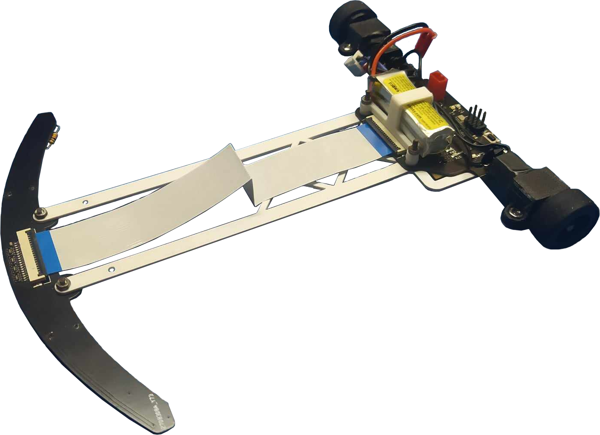

# RTS - Line Follower Robot

 

## Overview

A line follower robot built to autonomously navigate a track marked by a black line on a white surface. The goal is for the robot to complete the track as quickly as possible.

### Key Features

- **16 reflective sensors** for precise line detection
- **PD controller** for responsive steering
- **Bluetooth module** for remote control and PID parameter calibration
- **Lightweight design** at just **~70g**

## Electronics

This project features two custom-designed PCBs that are connected via a flexible flat cable (FFC):

- [**Sensor board**](/pcb/sensor_board/) - contains 16 reflective sensors for line detection

  
  

- [**Main board**](/pcb/main_board/) - responsible for the robot's core functionalities. It integrates the microcontroller, motor drivers, bluetooth module and power management circuitry

  
  

## Mechanical

The PCBs are mechanically joined with a lightweight 3D-printed connection bar. The motor and battery mounts are also 3D-printed.

### Tires

Several tire types have been tested:

- **MINI-Z Low Height Slick Tire 40° MZW39-40**: This tire provided solid grip and durability, serving as a reliable baseline for testing.
- **MINI-Z LM Wide High Grip Tire 20° MZT302-20**: This tire offered superior grip, which led to improved cornering speeds, but at the cost of durability.
- **MINI-Z RACING SLICK WIDE TYRES 20° MZW17-20B**: Initial tests showed slightly less traction, and require further testing.

## Android App

A dedicated Android app allows for remote control and tuning of the robot. Its main functions include **PID parameter calibration** and the ability to **start and stop** the robot's run.

  

## Troubleshooting

<b>Microcontroller doesn't program</b>

Make sure that the fusebits are set as bellow:

## Used Tools

 &nbsp;&nbsp;
 &nbsp;&nbsp;
 &nbsp;&nbsp;

